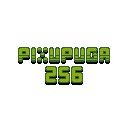

# Pixupuga 256

A puzzle game made entirely with Svelte, vanilla CSS and TypeScript.

## Prerequisites

### Install following:

VS Code ([Link](https://code.visualstudio.com/)) \
Node.js (18 or newer) and Npm ([Link](https://nodejs.org/en/)) \
Yarn ([Link](https://classic.yarnpkg.com/lang/en/docs/install/#windows-stable)) \
Svelte for VS Code ([Link](https://marketplace.visualstudio.com/items?itemName=svelte.svelte-vscode)) \
EditorConfig for VS Code ([Link](https://marketplace.visualstudio.com/items?itemName=EditorConfig.EditorConfig))

### After that, run following:

Run `yarn install` to install dependencies.

## Commands

`yarn dev` Starts the dev server. \
`yarn dev --host` Starts the dev server, but also makes it avaliable for others
                  in the same network. \
`yarn build` Builds the project. \

_To terminate any of the commands in the terminal, hit `CTRL + C`_
